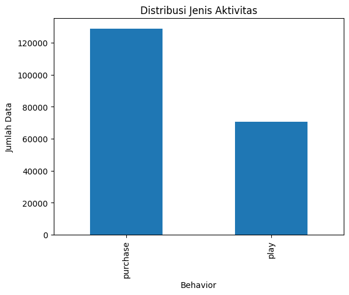
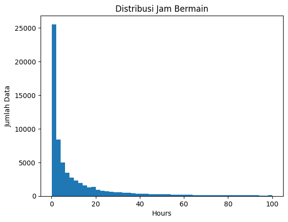
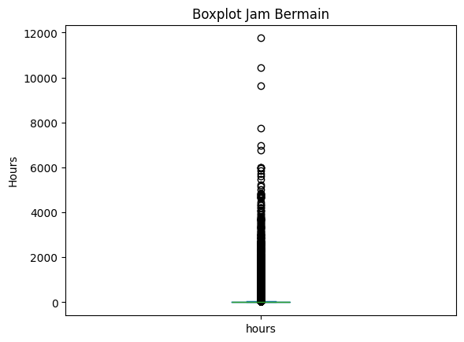
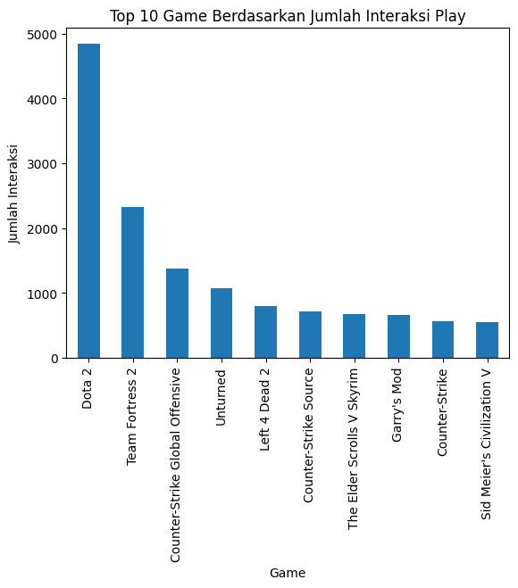
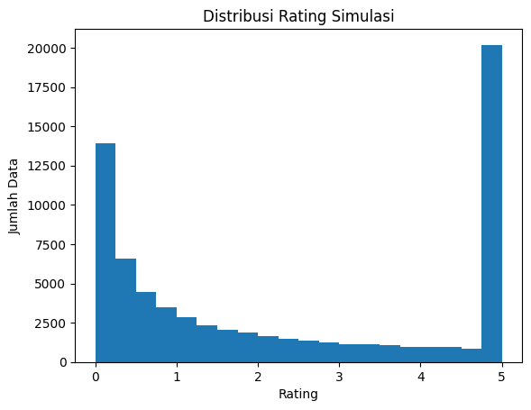
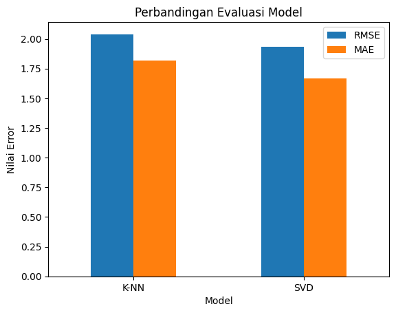

# Laporan Proyek Machine Learning - Sistem Rekomendasi Game Steam

## Domain Proyek

Game digital memiliki jumlah pilihan yang sangat banyak, terutama pada platform distribusi game seperti Steam. Kondisi ini dapat membuat pengguna kesulitan memilih game yang sesuai dengan minat mereka. Sistem rekomendasi dapat membantu pengguna menemukan game yang relevan berdasarkan pola interaksi pengguna lain.

Pada proyek ini, sistem rekomendasi dibuat menggunakan pendekatan collaborative filtering. Data yang digunakan berasal dari dataset Steam Video Games yang berisi interaksi pengguna terhadap game, seperti aktivitas pembelian dan aktivitas bermain. Karena dataset tidak memiliki rating eksplisit, nilai rating dibuat secara simulasi berdasarkan lama waktu bermain pengguna.

Pendekatan ini sejalan dengan penelitian Lomanto et al. tentang rekomendasi game Steam menggunakan collaborative filtering. Penelitian tersebut menjelaskan bahwa data jam bermain dapat digunakan sebagai dasar pembentukan rating simulasi ketika dataset tidak memiliki rating eksplisit.

Selain itu, penelitian Ticoalua dan Putra juga menunjukkan bahwa collaborative filtering dengan K-NN dapat digunakan untuk membangun sistem rekomendasi video game berbasis playtime pengguna.

Referensi:
Referensi: 
[Collaborative Filtering for Steam Games Recommendation](https://ieeexplore.ieee.org/document/10352243) 
[Rekomendasi Video Game Menggunakan Metode
Collaborative Filtering dengan K-NN](https://ejournal2.unud.ac.id/index.php/jnatia/article/view/88)

## Business Understanding

### Problem Statements

1. Bagaimana membangun sistem rekomendasi game Steam berdasarkan data interaksi pengguna?
2. Bagaimana mengubah data jam bermain menjadi rating simulasi agar dapat digunakan pada model collaborative filtering?
3. Model mana yang memiliki performa lebih baik antara K-NN dan SVD berdasarkan nilai RMSE dan MAE?

### Goals

1. Membuat sistem rekomendasi game Steam berbasis collaborative filtering.
2. Membuat rating simulasi dari data jam bermain pengguna.
3. Membandingkan performa model K-NN dan SVD.
4. Melakukan deployment model dalam bentuk aplikasi web sederhana.

### Solution Statements

Solusi yang digunakan pada proyek ini adalah membangun sistem rekomendasi dengan dua model collaborative filtering.

1. K-NN
   Model K-NN digunakan untuk mencari kemiripan pola antar pengguna berdasarkan rating simulasi.

2. SVD
   Model SVD digunakan untuk mempelajari pola laten antara pengguna dan game pada data rating.

Kedua model dievaluasi menggunakan RMSE dan MAE. Model dengan nilai error lebih kecil dipilih sebagai model utama.

## Data Understanding

Dataset yang digunakan adalah Steam Video Games Dataset. Dataset ini berisi data interaksi pengguna terhadap game Steam.

### Informasi Dataset

| Komponen | Keterangan |
|---|---|
| Jumlah data awal | 200.000 baris |
| Jumlah data setelah duplikat dihapus | 199.293 baris |
| Jumlah kolom yang digunakan | 4 kolom |
| Jenis aktivitas | purchase dan play |
| Data play | 70.489 baris |
| Data purchase | 128.804 baris |

### Fitur Dataset

| Kolom | Keterangan |
|---|---|
| user_id | ID pengguna Steam |
| game_title | Nama game |
| behavior | Jenis aktivitas pengguna, yaitu purchase atau play |
| hours | Lama waktu bermain atau nilai aktivitas |

### Kondisi Data

Berdasarkan pengecekan awal, dataset tidak memiliki missing values. Dataset memiliki 707 data duplikat, sehingga data duplikat dihapus sebelum masuk ke tahap analisis berikutnya.

Statistik deskriptif menunjukkan bahwa kolom hours memiliki nilai maksimum yang sangat tinggi, yaitu 11754 jam. Nilai ini menunjukkan adanya outlier pada data jam bermain.

### Distribusi Jenis Aktivitas



Distribusi data menunjukkan bahwa aktivitas purchase lebih banyak dibandingkan play. Namun, proyek ini hanya menggunakan data play karena data tersebut lebih relevan untuk menunjukkan preferensi pengguna.

### Distribusi Jam Bermain



Sebagian besar pengguna memiliki jam bermain yang rendah. Namun, terdapat beberapa pengguna dengan jam bermain yang sangat tinggi.

### Outlier Jam Bermain



Boxplot menunjukkan bahwa kolom hours memiliki outlier. Pada proyek ini, outlier tidak dihapus karena jam bermain yang tinggi dapat menunjukkan minat pengguna yang kuat terhadap game tertentu.

### Game yang Paling Sering Dimainkan



Dota 2 menjadi game dengan jumlah interaksi play tertinggi, diikuti oleh Team Fortress 2 dan Counter-Strike Global Offensive. Hal ini menunjukkan bahwa beberapa game populer memiliki jumlah interaksi bermain yang jauh lebih besar dibanding game lainnya.

## Data Preparation

Tahapan data preparation yang dilakukan adalah sebagai berikut.

1. Menghapus kolom yang tidak digunakan.
2. Mengubah tipe data user_id menjadi integer.
3. Mengubah tipe data hours menjadi float.
4. Mengecek missing values.
5. Menghapus data duplikat.
6. Memfilter data hanya pada aktivitas play.
7. Menghitung rata-rata jam bermain setiap game.
8. Membuat rating simulasi.
9. Membatasi nilai rating maksimal 5.
10. Menyiapkan data dalam format user_id, game_title, dan rating.

### Pembuatan Rating Simulasi

Dataset Steam tidak memiliki rating eksplisit dari pengguna. Oleh karena itu, rating simulasi dibuat berdasarkan perbandingan antara jam bermain pengguna dan rata-rata jam bermain pada game yang sama.

Rumus ini mengacu pada penelitian Lomanto et al. yang menggunakan jam bermain sebagai dasar untuk membuat rating simulasi pada sistem rekomendasi game Steam.

Rumus yang digunakan:

```text
Simulated Rating = (hour played / average hour played) x 5
```

Pada proyek ini, rumus tersebut diterapkan menggunakan kolom hours dan mean_hours. Nilai rating kemudian dibatasi maksimal 5 agar berada pada skala yang konsisten.


### Distribusi Rating Simulasi



Distribusi rating simulasi menunjukkan persebaran nilai rating yang digunakan oleh model collaborative filtering.

## Modeling

Model yang digunakan pada proyek ini adalah K-NN dan SVD dari library Surprise.

### K-NN

K-NN digunakan sebagai model pembanding. Model ini menggunakan cosine similarity dan pendekatan user-based collaborative filtering. Pendekatan ini sesuai dengan penelitian Ticoalua dan Putra yang menggunakan K-NN untuk mencari pengguna dengan pola playtime yang mirip pada sistem rekomendasi video game.

Parameter utama:

```python
sim_options = {
    'name': 'cosine',
    'user_based': True
}
```

Kelebihan K-NN:

- Mudah dipahami.
- Dapat mencari pengguna dengan pola preferensi yang mirip.
- Cocok digunakan sebagai baseline pada sistem rekomendasi.

Kekurangan K-NN:

- Model dapat menjadi berat pada dataset yang besar.
- Performa dapat menurun jika data user-item sangat sparse.

### SVD

SVD digunakan sebagai model utama. Model ini bekerja dengan mempelajari pola laten antara pengguna dan game pada data rating simulasi. Penelitian Lomanto et al. menunjukkan bahwa SVD dapat digunakan pada collaborative filtering untuk rekomendasi game Steam dan cocok untuk data interaksi pengguna-game yang cenderung sparse.

Kelebihan SVD:

- Cocok untuk sistem rekomendasi.
- Lebih efisien pada data user-item yang sparse.
- Memiliki performa evaluasi lebih baik pada proyek ini.

Kekurangan SVD:

- Interpretasi model tidak sesederhana K-NN.
- Membutuhkan proses pelatihan untuk mempelajari pola laten.

## Evaluation

Evaluasi dilakukan menggunakan RMSE dan MAE. Kedua metrik ini juga digunakan pada penelitian Lomanto et al. untuk mengevaluasi performa model collaborative filtering pada rekomendasi game Steam.

### Metrik Evaluasi

RMSE dan MAE digunakan untuk membandingkan rating aktual dengan rating hasil prediksi model. Rating aktual pada proyek ini berasal dari rating simulasi, sedangkan rating prediksi berasal dari hasil prediksi model K-NN dan SVD pada data testing.

**MAE (Mean Absolute Error)** mengukur rata-rata selisih absolut antara rating aktual dan rating prediksi. Nilai MAE yang lebih kecil menunjukkan bahwa rata-rata kesalahan prediksi model semakin rendah.

Rumus MAE:

```text
MAE = (1 / n) * Σ |yi - ŷi|
```

**RMSE (Root Mean Square Error)** mengukur akar dari rata-rata kuadrat kesalahan prediksi. RMSE lebih sensitif terhadap kesalahan prediksi yang besar karena error dikuadratkan terlebih dahulu. Nilai RMSE yang lebih kecil menunjukkan performa model yang lebih baik.

Rumus RMSE:

```text
RMSE = sqrt((1 / n) * Σ (yi - ŷi)^2)
```

Keterangan:

- `yi` adalah rating aktual.
- `ŷi` adalah rating hasil prediksi model.
- `n` adalah jumlah data prediksi.

Pada proyek ini, RMSE dan MAE digunakan untuk menilai seberapa jauh rating prediksi model dari rating simulasi yang sebenarnya. Model dengan nilai RMSE dan MAE lebih rendah dipilih sebagai model terbaik.

### Hasil Evaluasi

| Model | RMSE | MAE |
|---|---:|---:|
| K-NN | 2.0402 | 1.8189 |
| SVD | 1.9321 | 1.6680 |

### Visualisasi Perbandingan Model



Berdasarkan hasil evaluasi, model SVD memiliki nilai RMSE dan MAE yang lebih kecil dibandingkan K-NN. Oleh karena itu, SVD dipilih sebagai model utama.

## Deployment

Deployment dilakukan menggunakan Gradio pada Hugging Face Spaces. Aplikasi memungkinkan pengguna memasukkan User ID Steam dan memilih model yang digunakan, yaitu SVD atau K-NN.

File deployment yang digunakan:

| File | Keterangan |
|---|---|
| app.py | File utama aplikasi Gradio |
| requirements.txt | Daftar library yang dibutuhkan |
| steam_cleaned.csv | Dataset yang sudah diproses |
| steam_svd_model.pkl | Model SVD yang sudah dilatih |
| steam_knn_model.pkl | Model K-NN yang sudah dilatih |

Alur aplikasi:

1. Pengguna memasukkan User ID Steam.
2. Pengguna memilih model SVD atau K-NN.
3. Sistem memprediksi rating untuk game yang belum dimainkan pengguna.
4. Sistem menampilkan 5 game dengan prediksi rating tertinggi.

Link deployment:

[Steam Game Recommender System](https://huggingface.co/spaces/Zafnat/Rekomendasi-Game-Steam)

## Kesimpulan

Berdasarkan hasil proyek yang telah dilakukan, sistem rekomendasi game Steam dapat dibangun menggunakan pendekatan collaborative filtering. Dataset Steam tidak memiliki rating eksplisit dari pengguna, sehingga rating simulasi dibuat berdasarkan lama waktu bermain pengguna terhadap suatu game.

Data difilter hanya pada aktivitas play karena data tersebut lebih relevan untuk menunjukkan preferensi pengguna. Nilai hours dibandingkan dengan rata-rata jam bermain pada game yang sama, lalu dikonversi menjadi rating simulasi dengan skala maksimal 5.

Model yang digunakan adalah K-NN dan SVD. Kedua model dievaluasi menggunakan RMSE dan MAE. Model K-NN memperoleh RMSE sebesar 2.0402 dan MAE sebesar 1.8189. Model SVD memperoleh RMSE sebesar 1.9321 dan MAE sebesar 1.6680.

Berdasarkan hasil tersebut, SVD dipilih sebagai model utama karena memiliki nilai error yang lebih rendah dibandingkan K-NN.

## Referensi

1. William Evan Lomanto, Verry Andrian, Said Achmad, dan Rhio Sutoyo. Collaborative Filtering for Steam Games Recommendation. IEEE.  
   Link: https://ieeexplore.ieee.org/document/10352243

2. Kendrick Raphael Ticoalua dan Ida Ayu Gde Suwiprabayanti Putra. Rekomendasi Video Game Menggunakan Metode Collaborative Filtering dengan K-NN. JNATIA, Volume 4, Nomor 3, Mei 2026.  
   Link: https://ejournal2.unud.ac.id/index.php/jnatia/article/view/88

3. Tamber. Steam Video Games Dataset. Kaggle.  
   Link: https://www.kaggle.com/datasets/tamber/steam-video-games

4. Surprise Documentation.  
   Link: https://surpriselib.com/

5. Gradio Documentation.  
   Link: https://www.gradio.app/docs
